#  Introduction 

This project contains the core packages for the ROS2-based AGV platform IOTBot: the communication package 'iotbot_shield' for the Siemens SIMATIC IOT2050 expansion board, 'iotbot_interface' for custom msg- and srv-types and 'iotbot_motion' with nodes for calculating the kinematics. Currently differential drive and mecanum drive, each in combination with two motor variants. All four variations can be launched bundled by their respective launch-files, as followed.

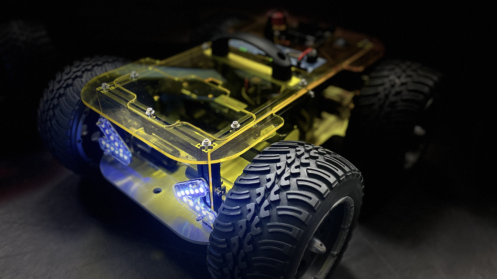<br>

### Table of Contents
* [Introduction](#introduction)
* [Electrical components and functions](#electrical-components-and-functions)
    * [Charging the robot](#charging-the-robot)
    * [Battery switch](#battery-switch)
    * [On & Off button](#on-&-off-button)
    * [Emergency stop](#emergency-stop)
    * [Turning off your robot](#turning-off-your-robot)
    * [Extension-Shield and onboard Sensors: iotbot_shield_node](#extension-shield-and-onboard-sensors-iotbot_shield_node)
    * [Kinematic variations: iotbot_motion_X_node](#kinematic-variations-iotbot_motion_x_node)
* [Mechanical components and functions](#mechanical-components-and-functions)
    * [Wheel change](#wheel-change)
    * [Removing the upper frame](#removing-the-upper-frame)
    * [How to open the frame](#how-to-open-the-frame)
* [Installation Instructions for Prerequirements](#installation-instructions-for-prerequirements)
    * [Installing Debian Buster on the IOT2050](#installing-debian-buster-on-the-iot2050)
    * [Connecting to your robot via SSH](#connecting-to-your-robot-via-ssh)
    * [Setting up the UART Interface](#setting-up-the-uart-interface)
    * [Installing the Docker-Engine](#installing-the-docker-engine)
    * [Setting up your Joystick](#setting-up-your-joystick)
* [Software Building Instructions](#software-building-instructions)
    * [Building the Docker-Image](#building-the-docker-image)
    * [Creating the Docker-Container](#creating-the-docker-container)
* [Usage Instructions](#usage-instructions)
    * [Powering up the robot](#powering-up-the-robot)
    * [Starting and entering your container](#starting-and-entering-your-container)
    * [Launching the nodes](#launching-the-nodes)
    * [Controlling the robot](#controlling-the-robot)
    * [Let the Docker-Container auto-start](#creating-the-docker-container)
* [Troubleshooting](#troubleshooting)
* [ROS1 compatibility](#ros1-compatibility)
* [NodeRED extension](#nodered-extension-&#x1F39B;)
* [Next steps](#next-steps)
    * [Example I: Sending a String and receiving it back](example-ii:-sending-a-string-and-receiving-it-back)
    * [Example II: Displaying the robots battery voltage](example-ii:-displaying-the-robots-rattery-voltage)
    * [Example III: Dont hit the Wall! (please)](example-iii:-dont-hit-the-wall!-(please))
* [Related ongoing and future work](#related-ongoing-and-future-work)
* [References](#references)
* [Safety instructions](#safety-instructions)
    * [Limits of use](#limits-of-use)
    * [Predictable misapplication](#predictable-misapplication)
    * [Remaining risks](#remaining-risks)

# Electrical components and functions

## Charging the robot
The round socket intended for charging is located in the rear area of the cover plate. The rubber cover should always be closed when the battery is in use to protect the charging socket from the entry of foreign particles. Note that the robot cannot move during the charging process! A new enable signal is necessary after every charging process.
<br>

## Battery switch
The switch is a toggle switch with a latching function. It is not used for booting and lowering the platform, but for de-energising the circuit when the platform is switched off or transported for a longer period of time. Even if the robot is left unattended for some time (e.g. lunch break), it is recommended to release it via this switch.
The switch is located in the rear area of the cover plate and has a rectangular shape.
<br>

## On button
This button is used directly for booting the computer. It does not lock when pressed and must be pressed for a few seconds to prevent it from being accidentally switched on. An indicator for sufficiently long pressing is the headlights and the IOT2050. It is located near the charging socket at the rear of the platform as a round black button.

## Turning off your robot
To shut down the robot safely, it is necessary to connect to it. Either directly using a screen via DisplayPort and a keyboard or via a remote connection using ssh (see here).
There, the computer can be shut down with the Linux command `sudo shutdown now`. After a successful shutdown, the STAT LED of the IOT2050 lights up red. Alternatively, the entire robot can be switched off by hitting the battery switch.

## Emergency stop
With this robot, the emergency stop is not primarily for the protection of the human operator, but rather for the protection of the machine in the event of unexpected movements due to programming errors or false signals from sensors. To activate it, press the button as vertically as possible from above. To unlock, turn it to the right until it disengages.
Before unlocking, make sure that the source of danger has been eliminated. The robot does not start automatically after unlocking. Operation must first be enabled again.
<br>

## Extension-Shield and onboard Sensors: iotbot_shield_node

The ROS2 node for communication between the microprocessor and the IOT2050 publishes on the following topics and receives these services:
<br>

| Description               | Topic                 | Message type                         |
|---------------------------|-----------------------|--------------------------------------|
| Controller Values         | /joy                  | sensor_msgs/msg/joy                  |
| Taget Motorspeed values   | /iotbot/rpm           | iotbot_interface/msg/RotationSpeed   |
| Current Motorspeed values | /iotbot/rpm/return    | iotbot_interface/msg/RotationSpeed   |
| Inertial Measurement Unit | /iotbot/imu           | sensor_msgs/msg/Imu                  |
| Distance measurements     | /iotbot/tof           | std_msgs/msg/Float32MultiArray       |
| Battery Voltage           | /iotbot/battery       | iotbot_interface/msg/Battery         |
<br>

| Description                    | Service                  | Message type                      |
|--------------------------------|--------------------------|-----------------------------------|
| Determination of light pattern | iotbot/srv/send_lighting | iotbot_interface/src/SendLighting |
| Enable signal for driving      | iotbot/srv/send_enable   | iotbot_interface/src/SendEnable   |
<br>

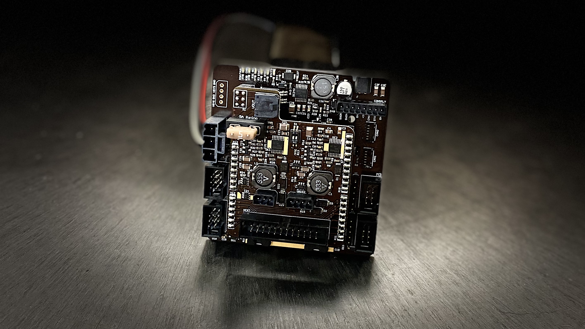<br>

## Kinematic variations: iotbot_motion_X_node

The ROS2 nodes for calculating the motion of the robot publish on the following topics:
<br>

| Description               | Topic                 | Message type                         |
|---------------------------|-----------------------|--------------------------------------|
| Taget Motorspeed values   | /iotbot/rpm           | iotbot_interface/msg/RotationSpeed   |
| Taget Velocity vector     | /cmd_vel              | geometry_msgs/msg/Twist              |
<br>

### Skid Drive: iotbot_motion_differential_node

<br>

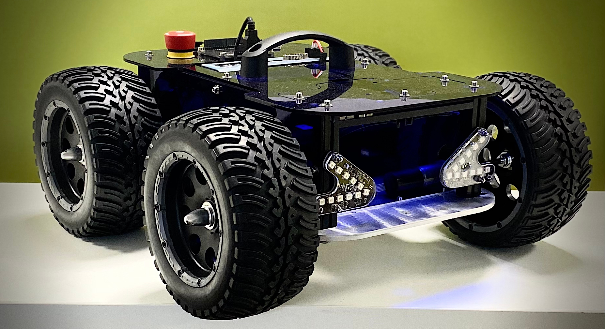<br>

### Mecanum Drive: iotbot_motion_mecanum_node
<br>

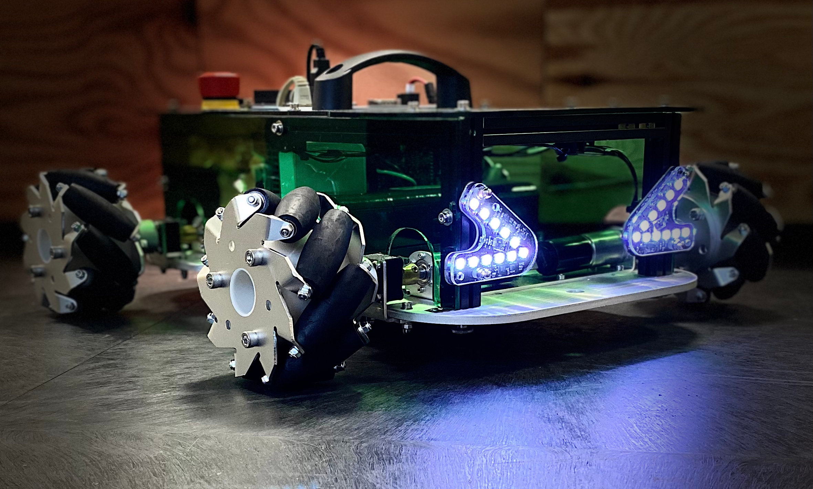<br>

# Mechanical components and functions

Depending on the variant you chose at the time of building, your platform is equipped with either Faulhaber or Pololu motors. See the description of the respective drive systems in the further course of the chapter.
<br>

## Wheel change

To change the wheel, do not loosen the screws on the axle couplings. The couplings are made of brass, which is why the threads cut in them are very sensitive. 
To change between the wheel concepts , use an Allen key or similar to be able to loosen the screws and/or to apply a leverage to the propeller screws.
<br>

Change Mecanum wheel to "off-road" wheel:
- Loosening the grub screw in the wheel hub
- Pulling the wheel off the drive shaft
- Mounting the "offroad" wheel
- Insert the Allen key into the hole in the propeller driver on the wheel. 
- Lock the driver while holding the wheel.
- Check if it is firmly seated.
<br>

Change from "off-road" wheel to Mecanum wheel:
- Like the change described above, but backwards.
- Attention: Push the Mecanum wheel in as far as it will go but leave a small gap so that the wheel does not rub against the suspension.
- Arrangement: when looking from above, all the rollers of the individual wheels should point towards the centre of the robot so that a cross could be formed.
<br>

Differential drive:
- Remove front wheels
- Convert the rear wheels to "off-wheel" wheels. 
- Insert the front castor through the hole in the middle and lock it with the wing nut. 
<br>

## Removing the upper frame
The top frame has to be removed if, for example, you want to make changes to the electronics in the interior or connect sensors, cameras or similar to the USB hub.
Since unscrewing the top plate is too time-consuming and not recommended, knurled screws have been used on the underside of the robot to screw the bottom plate to the chassis. These screws can be loosened and tightened without any additional tools. Always use this option with caution and do not tighten the screws with pliers, as this can destroy the thread in the chassis.
<br>

## How to open the frame
The frame must be opened, for example, if slot nuts or hammer head screws are to be inserted into the frame, as the ones already inserted are not enough. It cannot be opened at any point!
Precondition: Upper frame removed as described in the previous section.
<br>

Proceed as follows:
- Remove the cables & carefully cut open the cable ties.
- Remove the Spotlight boards so they do not get damaged.
- Remove the side cover plates. Use an 2.5mm Allen key.
- Locate the profile with the hole in a side groove
- Use a flathead screwdriver to loosen the screw in the hole
- Turn the frame apart by slightly loosen one profile after the other and push them out of the grooves in the othe profiles. Attention: Slot stones falling out!
- Insert the sliding blocks or square-head screws and reassemble the frame.
<br>

# Installation Instructions for Prerequirements &#128450;

The following preparations must be made for the operation of the robot.

## Installing Debian Buster on the IOT2050 &#128421;

The operating system for the IOT2050 is to be downloaded as <a href="https://support.industry.siemens.com/cs/document/109780231/simatic-iot2050-sd-card-example-image?dti=0&lc=en-DE">SIMATIC IOT2050 SD-Card example image</a> . After a successful download, a tool such as Win32DiskImager <a href="https://win32diskimager.download/">Win32DiskImager</a> can be used to burn this image onto an SD card of at least 16GB. 

The SD card can then be inserted into the device and initially switched on. For the first boot process, we recommend a direct connection via monitor and keyboard. The default username and password are `root`. Further installation instructions can be taken from the installation process. 

> **_NOTE:_** Under no circumstances should the IOT2050 be switched on without a bootable SD card! 

After successfully installing and setting up the operating system, the following commands should be used to update the system and install git. The last one enables the donwload of this repository:


```console
$ sudo apt update
$ sudo apt upgrade

$ sudo apt install git
$ git clone ...
```
<br>

## Connecting to your robot via SSH

To access your robot remotely, the IOT2050 must be on a network with your machine.
This can be done via a router or a direct connection between your device and the IOT2050.

When connecting via a router, both devices must be connected to it. Select the Ethernet port P2, which is configured with DHCP by default. This allows the IOT2050 to receive an IP from your router dynamically:
<br>
<br>
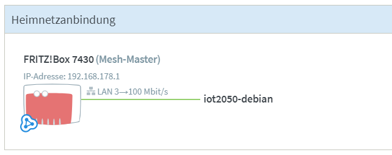
<br>

For the direct connection between your device and the IOT2050, select the Ethernet interface P1, which has the static IP address 192.168.200.1 by default. Here, a static IP address in the subnet 192.168.200 must also be assigned in the settings of the network adapter of your host computer.

In both cases, a terminal of the IOT2050 can be reached via its IP address. To do this, open a command line. CMD in the search bar on Windows 10, Ctrl+Alt+T on Ubuntu.
The SSH tools are already available in most operating systems, so you can access your robot via the user name and IP address of the IOT2050 as follows:

```console
$ ssh root@[IP-ADDRESS]
```

## Setting up the UART Interface &#128421;

To allow communication between the extension board and the computer, the corresponding pins of the serial interface must be configured accordingly.Use the terminal command `iot2050setup` to access the settings of the IOT2050. Navigate to the GPIO settings under the menu option `Configure Arduino I/O`.

Activate the communication via the menu option `Enable UART on IO0-IO3` and follow the instructions there:

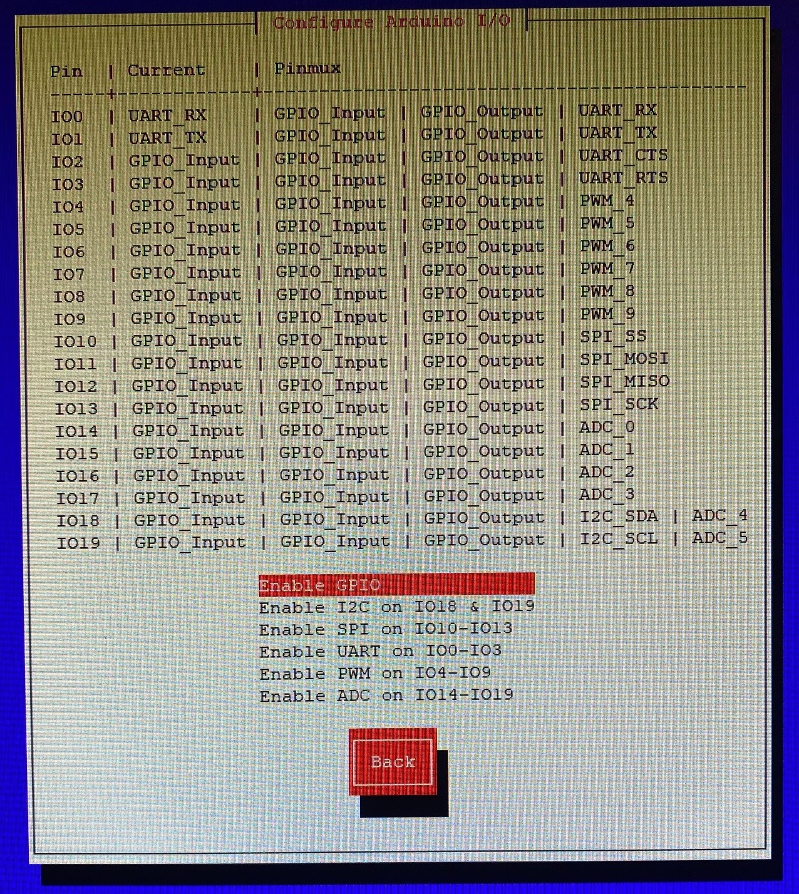 <br>

## Installing the Docker-Engine &#x1F40B;

The following installation instructions are taken from the official <a href="https://docs.docker.com/engine/install/debian/">docker docs</a>  documentation. We recommend an installing through the use of their repository. 

Before you install Docker Engine for the first time on a new host machine, you need to set up the Docker repository. Afterward, you can install and update Docker from the repository. Update the `apt` package index and install packages to allow `apt` to use a repository over HTTPS:

```console
$ sudo apt-get update
$ sudo apt-get install \
    ca-certificates \
    curl \
    gnupg \
    lsb-release
```
<br>

Add Docker’s official GPG key:

```console
$ curl -fsSL https://download.docker.com/linux/debian/gpg | sudo gpg --dearmor -o /usr/share/keyrings/docker-archive-keyring.gpg
```
<br>

Use the following command to set up the stable repository:

```console
$ echo \
  "deb [arch=$(dpkg --print-architecture) signed-by=/usr/share/keyrings/docker-archive-keyring.gpg] https://download.docker.com/linux/debian \
  $(lsb_release -cs) stable" | sudo tee /etc/apt/sources.list.d/docker.list > /dev/null
```
<br>

Update the `apt` package index, and install the latest version of Docker Engine and containerd:

```console
$ sudo apt-get update
$ sudo apt-get install docker-ce docker-ce-cli containerd.io
```
<br>

Verify that Docker Engine is installed correctly by running the hello-world image:

```console
$ sudo docker run hello-world
```
<br>

## Setting up your Joystick &#127918;

A joystick can be used to operate the IOTBot. For this purpose, the IOT2050 must be extended by a Debian-compatible Bluetooth stick. PlayStation&reg; 4 and PlayStation&reg; 5 controllers were used, which are interpreted identically in their operating interface. The initial start-up of a Bluetooth controller follows.

Start the Bluetooth controller in the operating system:

```console
$ bluetoothctl
```
<br>

Set up the controller and prepare for scanning:

```console
$ agent on 
$ default-agent 
$ power on 
$ discoverable on 
$ pairable on
```
<br>

Put the PlayStation&reg; Controller into connection mode by pressing the Share and PS buttons simultaneously. 
Rapid flashing indicates the status.

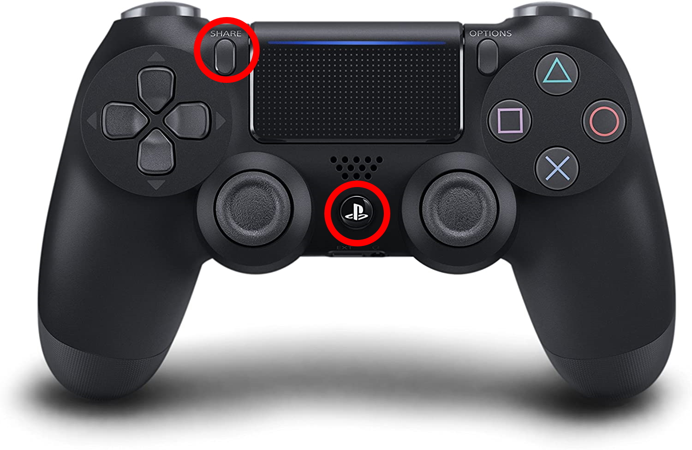 <br>

Now start the scanning process:

```console
$ scan on
```
<br>

The connection process so far should look like this. Your joystick is now recognised as a wireless controller. Copy the MAC address of the device for the rest of the procedure.

```console
root@iot2050-debian:~# bluetoothctl
Agent registered
[bluetooth] # agent on
Agent is already registered
[bluetooth] # power on
Changing the power on succeeded
[bluetooth] # discoverable on
Changing discoverable on succeeded
[CHG] Controller XX:XX:XX:XX:XX:XX Discoverable: yes
[bluetooth] # pairable on
Discovery started
[CHG] Controller XX:XX:XX:XX:XX:XX Discovering:yes
[NEW] Device XX:XX:XX:XX:XX:XX Wireless Controller
[bluetooth] # 
```
<br>

Connect the controller using the following commands and its MAC address. If needed, press the PlayStation button again when the light signals stop flashing.

```console
$ pair XX:XX:XX:XX:XX:XX 
$ trust XX:XX:XX:XX:XX:XX 
$ connect XX:XX:XX:XX:XX:XX
$ exit 
```
<br>

NOTE: These steps are only required once at the very beginning. From now on, when the PS button is pressed, the joystick should automatically connect to the IOT2050 once it has successfully booted up. These operations are only then necessary again if the controller has been connected to another device in the meantime.
<br>

# Software Building Instructions &#128736;

## Building the Docker-Image

```console
$ docker build . -t --cpuset-cpus 0-2 iotbot_basis 
```

<br>

## Creating the Docker-Container

```console
$ docker run --name iotbot_basis --privileged -v /dev:/dev --network host --group-add dialout iotbot_basis
```
<br>

# Usage Instructions &#128665;

## Starting and entering your container

```console
$ docker start iotbot_basis
$ docker exec -it iotbot_basis bash 
```
<br>

## Launching the nodes

```console
$ ros2 launch /home/iotbot_ws/src/iotbot/iotbot_launch/skid_performance.py
```
<br>

## Controlling the robot

A controller can be requested to connect by pressing a specific button once. For the recommended controllers, it is the symbol between the axes.
To operate the Robot, the following buttons and axes of the controller are assigned as follows:

<br>

| Axis  | DS5                       | Idle position | Value range | function          | 
|-------|---------------------------|---------------|-------------|-------------------|
| [0]   | Joystick L: left & right  | 0.0           | 1.0 to -1.0 | Steering
| [1]   | Joystick L: up & down     | 0.0           | 1.0 to -1.0 | not in use
| [2]   | L2                        | 1.0           | 1.0 to -1.0 | not in use
| [3]   | Joystick R: left & right  | 0.0           | 1.0 to -1.0 | not in use
| [4]   | Joystick R: up & down     | 0.0           | 1.0 to -1.0 | Throttle
| [5]   | R2                        | 1.0           | 1.0 to -1.0 | not in use
| [6]   | D-Pad: left & right       | 0.0           | 1.0 to -1.0 | not in use
| [7]   | D-Pad: up & down          | 0.0           | 1.0 to -1.0 | not in use

<br>

| Button    | DS5           | Idle position | Value range   | function          | 
|-----------|---------------|---------------|---------------|-------------------|
| [0]       | Cross         | 0             | 0 or 1        | not in use
| [1]       | Cyrcle        | 0             | 0 or 1        | not in use
| [2]       | Triangle      | 0             | 0 or 1        | not in use
| [3]       | Square        | 0             | 0 or 1        | Light pattern: Parking light
| [4]       | L1            | 0             | 0 or 1        | Light pattern: Turning left
| [5]       | R1            | 0             | 0 or 1        | Light pattern: Turning right
| [6]       | L2            | 0             | 0 or 1        | not in use
| [7]       | R2            | 0             | 0 or 1        | not in use
| [8]       | SHARE         | 0             | 0 or 1        | Light pattern: Circular light
| [9]       | OPTIONS       | 0             | 0 or 1        | Light pattern: Siren
| [10]      | PS            | 0             | 0 or 1        | Enable driving
| [11]      | L3            | 0             | 0 or 1        | not in use
| [12]      | R3            | 0             | 0 or 1        | not in use
| [13]      | Map           | 0             | 0 or 1        | Light pattern: Warning light

<br>

## Let the docker container auto-start

```console
$ docker start iotbot_basis
$ docker exec -it iotbot_basis bash
$ echo “ros2 launch /home/iotbot_ws/src/iotbot/iotbot_launch/skid_performance.py" >> ~/.bashrc
$ exit
```
<br>

# ROS1 Compatibility &#129302;

[ROS1 Noetic Node](https://github.com/EduArt-Robotik/iotbot) <br>
[ROS1 Noetic virtuall Joystick](https://github.com/EduArt-Robotik/iotbot_virtual_joy) <br>

<br>

# NodeRED extension &#x1F39B;

Modules were programmed for communication between NodeRED and ROS2. The beta version is being tested as part of the Mission2Mars event and was provided as a pre-configured Docker container.
The following subchapters thus describe a test status of these extensions and the handling of the modules with examples.
NodeRED's browser-based IDE can be reached by the IOT2050's IP-Address on the Port 1880, e.g.:

```console
192.168.1.237:1880/
```

<br>

## Example I: Sending a String and receiving it back

For a first introduction to the operation of the new ROS2 communication modes, we will first send a string into the ROS2 framework and then directly read it back in and display it:
<br>
<br>
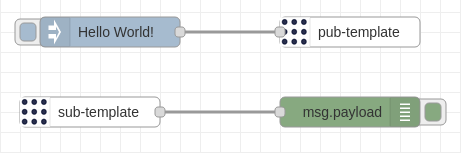 <br>

The Inject block is configured to output the string "Hello World!" as soon as its button is pressed:

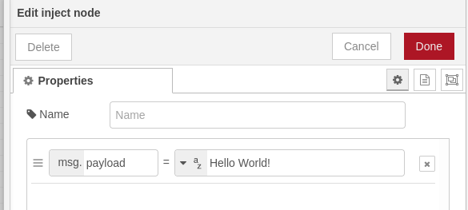 <br>

To publish the data in the ROS2 framework, we create a ROS2-Pub block, which is configured as follows. Please note that the topic must be entered and the corresponding message type must be added:

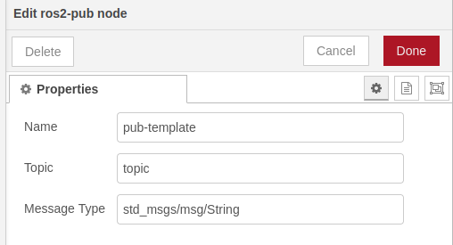 <br>

Now that our string is available on the ROS2 network, we can read it back into NodeRED using a ROS2 Sub-Block:

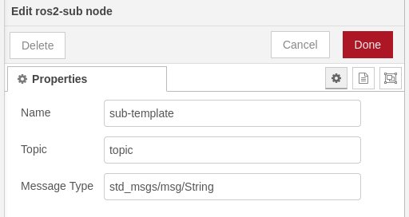 <br>

Finally, we use a debug block to be able to display the messages that have been read in:

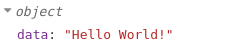 <br>

## Example II: Displaying the robots battery voltage

NodeRED provides us with a wide range of extensions. One of them is the creation of a graphical user interface.
With the help of the module node-red-dashboard, which can be installed via the palette manager under settings, we can visualise operating data:

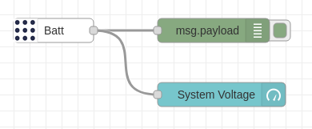 <br>

In this case, the battery voltage was read in with a ROS2 Sub-Block configured in this way:

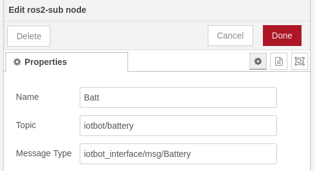 <br>

The GUI can be reached with an addition to the IDE address (e.g. `192.168.1.237:1880/ui`) and in our case displays the measurement data as a tachometer:

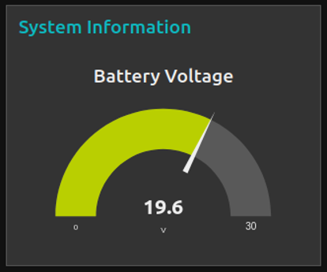 <br>

## Example III: Dont hit the Wall! (please)

After the two previous examples, we are now ready to give our IOTBot a rather important feature - it should no longer be able to drive into walls (or us).
To achieve this, we read the ToF distance measurements from ROS2, take the value for one of the front sensors and operate the robot with ROS2-messages from NodeRED:

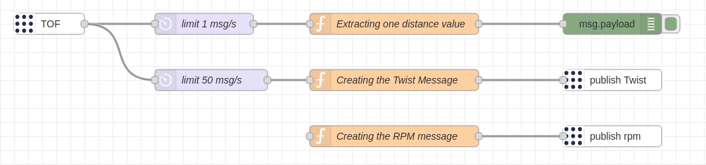 <br>

Let's take a look at the code in the top function block and find out how we can seperate one measurement.
We create a ne variable called `newMsg`, assign one element of the incoming payload to it and output it as the new message:

```javascript
var newMsg = { payload: msg.payload.data["0"] };
return newMsg;
```

With this experience we can now create a so-called twist message, where we always check if our robot is not too close to an obstacle. Twist messages define the speed in direction and rotation, so we can reduce the speed if something is in front of our robot:

```javascript
throttle = 0.0;

if (msg.payload.data["0"] < 0.2) {
    throttle = 0.0;
    }
    else {
    throttle = 0.2; 
    }

var twist = {
    linear : {
        x : throttle,
        y : 0.0,
        z : 0.0,
    },
    angular : {
        x : 0.0,
        y : 0.0,
        z : 0.0
    }
    };
msg.payload = twist;
return msg;
```

Congratulations, with a few lines of code you have saved the life of a robot. Another way to control the robot is to give it the speeds for its four motors directly, as here. Try changing the code so that the distance is also checked here:

```javascript
var rpm = { front_left_rpm: 20, 
            front_right_rpm: 20, 
            rear_left_rpm: 20, 
            rear_right_rpm: 20 }
msg.payload = rpm;
return msg;
```

# Next Steps &#128694;

<p> &#9989 Initial structure: separate nodes for the shield and the kinematic versions, the second inherits from a parent class. <br>
 
<p> &#9989 Creating a package for own message types: iotbot_interface.<br>

<p> &#9989 Implementation of the serial communication in iotbot_shield_node in a second thread.<br>

<p> &#9989 Calculation of the kinematic models in the iotbot_motion_X_nodes. <br>

<p> &#9989 Implementation of the IMU in the iotbot_shield_node.<br>

<p> &#9989 Implementation of the Time of Flight sensors in the iotbot_shield_node. <br>

<p> &#9989 Programming of calling all possible light patterns from the MCU in the iotbot_shield_node. <br>

<p> &#9989 Providing a service to call light signals from other nodes.<br>

<p> &#x1F532 Integration of an operating concept for the PlayStation&reg; 4 and PlayStation&reg; 5 controller.<br>

<p> &#x1F532 Integration and organization of all aplications as microservices within docker-compose for easy system-startup.<br>

<br>

# Related ongoing and future work &#x1F477;

&#x1F39B;
Completed NodeRED-Modules for general ROS2-Connectivity and IOTBot-related examples. 
<br>

&#128377;
GUI for operation via the keyboard respectively the <a href="https://github.com/EduArt-Robotik/iotbot_virtual_joy">ROS1 version</a>. 
<br>

&#128294;
Using IMU-data for controling a [leveling-plattform](documentation/stl/Dynamixel_Mount.stl) including LIDAR scanner. 
<br>

&#128247;
Joystick-controlled tilt-plattform for POV cameras. 
<br>

&#x1F575;
ROS2-ready <a href="https://openmv.io/ ">OpenMV H7</a> Extension with examples.
<br>

&#128225;
ROS2-ready UWB-RTLS Extensionboard. Keep your eyes open for a swarm of IOTBots! <br>

<br>

# Safety instructions
Read this document carefully before using the product for the first time and make sure that no safety-related questions remain unanswered. Use this document only as an aid for expansions and handling of the robot. Pay attention to the warnings and symbols described below in order to understand potential dangers for the user and the device and to avoid accidents. 
<br>

## Limits of use

|     | Risk of damage to the robot platform and/or objects in the surroundings due to operation in an unsuitable environment!          |
|-----------------------------------------------------------------------|--------------------|

Do not operate the robotic platform 
- not in areas with holes and/or stairs.
- not on uneven, wet and/or soft surfaces.
- if on raised platforms (e.g. table, pedestal, stage), then only on the rack provided for this purpose.
- not in outdoor areas.
- only at a suitable ambient temperature between 0°C and 40°C .
- not in wet or humid environments.
- not in potentially explosive atmospheres.
- if a minor, then only under the supervision of a parent or tutor.
<br>

## Predictable misapplication

|     | Dangers result from incorrect handling of the unit (electrical as well as mechanical)!          |
|-----------------------------------------------------------------------|--------------------|

- Do not short-circuit the battery!
- Do not damage the battery with intent!
- Do not extend the device with extensions with sharp edges or tips!
- Risk of crushing or impact injuries if the robot falls down!
- Always switch off the unit completely before making mechanical or electrical changes and disconnect the accumulator from the entire system when making major modifications!
<br>

|     | In case of inappropriate programming and use of the robotic platform, damage may occur to the platform itself or to surrounding objects.         |
|-----------------------------------------------------------------------|--------------------|
<br>

|     | Incorrect storage can also cause damage to the robot. Incorrect storage can also cause damage to the robot. Therefore, store the robot as described.       |
|-----------------------------------------------------------------------|--------------------|

- not in direct sunlight.
- only on the storage rack provided.
- for long storage with the battery unplugged.
- only in dry rooms.
- not within reach of children when used unsupervised.
<br>

## Remaining risks

|     | Under certain circumstances, the platform can cause serious damage to health even when used professionally!          |
|-----------------------------------------------------------------------|--------------------|

- Do not work with the platform if you suffer from epilepsy.
- Looking directly and continuously at the light emitting diodes from a short distance may cause irreversible eye damage.
<br>

|     | Fire hazard due to overheating of the robot platform!         |
|-----------------------------------------------------------------------|--------------------|

- Do not operate the robot unsupervised.
- Only charge the accumulator under supervision .
<br>

|     | Danger of burns from touching heated parts!       |
|-----------------------------------------------------------------------|--------------------|

The following parts of the robot platform heat up during operation and must not be touched until they have had enough time to cool down:
- IOT expansion board
- Motors after heavy use
- If applicable, components attached afterwards

|     | Danger of squeezing due to rotating components.       |
|-----------------------------------------------------------------------|--------------------|

- Avoid reaching into the drive system.
- Activate the emergency stop if you notice a malfunction during operation.
- Lift and carry the robot by the handle provided.
<br>

|     | Injuries due to unexpected weight.     |
|-----------------------------------------------------------------------|--------------------|

- Expect the weight of the platform to become heavier when lifting.
<br>

|     | Risk of injury from falling!     |
|-----------------------------------------------------------------------|--------------------|

- Do not place the platform in escape routes or walkways to avoid tripping over it.
<br>

# References

[](https://www.eduart-robotik.com)<br>